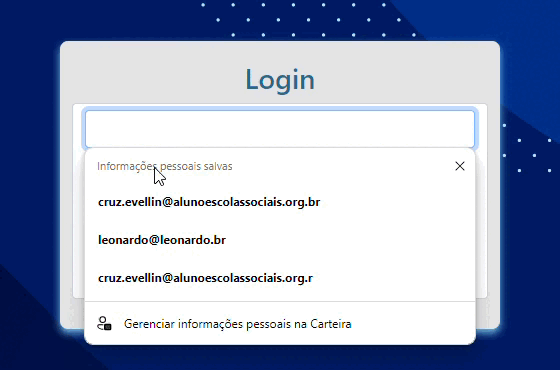

# Projeto de Cadastro de Usuários ⚜️

Bem-vindo ao Sistema de Cadastro de Usuários – uma aplicação web elegante e fácil de usar, projetada para tornar o gerenciamento de usuários simples e eficiente. Com uma interface intuitiva, este projeto oferece um conjunto de funcionalidades essenciais para controlar suas informações de usuários de forma
eficaz.


teste

## Sumário 🔗
- [Descrição do projeto](#descrição-do-projeto-📄)
- [Tecnologias Utilizadas](#tecnologias-utilizadas-🔧)
- [Instalação](#instalação-🛠️)
- [Códigos](#códigos-📝)
- [Como Usar](#como-usar-🚀)
- [Finalização do Projeto](#finalização-do-projeto-🔥)
- [Links Importantes](#links-importantes-🌐)


# Descrição do projeto 📄

Este projeto é uma aplicação web projetada para gerenciar usuários com uma interface simples e intuitiva. Ele consiste em duas telas principais:

* Tela de Login: Permite que o usuário se autentique inserindo um email e uma senha. Após a autenticação bem-sucedida, o usuário é redirecionado para a tela de cadastro.

* Tela de Cadastro: Nesta tela, o usuário pode adicionar novos nomes à lista, visualizar usuários já cadastrados e editar informações existentes. A lista de usuários é apresentada em uma tabela onde é possível gerenciar os nomes cadastrados de maneira fácil e rápida.

A aplicação proporciona um fluxo claro e eficiente para o gerenciamento de usuários, com funcionalidades básicas para adicionar, visualizar e editar informações, garantindo uma experiência de usuário fluida e sem complicações.


# Instalação 🛠️

Para rodar o projeto localmente, siga estes passos:

1. ## Clone o repositório:
   
   Abra seu terminal e execute o comando abaixo para clonar o repositório:

git clone:
````
 https://github.com/Evellincruz/login-cad.git
   ````

2. Navegue para o diretório do projeto:

Entre no diretório do projeto clonado:

````
cd login-cad
````
Instale as dependências;

Se o projeto usa Node.js, você pode instalar as dependências com:

````
npm install
````
Ou, se estiver usando o Yarn:

````
yarn install
````
Configure o ambiente (se necessário):

Crie um arquivo .env na raiz do projeto e adicione as variáveis de ambiente necessárias. Consulte o arquivo .env.example ou a documentação do projeto para detalhes.

Inicie o projeto:

Para iniciar o projeto localmente, execute:

````
npm start
````

# Como Usar 🚀

Tela de Login:

Preencha o email e a senha e clique no botão "ACESSAR".
Se ambos os campos estiverem preenchidos, você será redirecionado para a tela de cadastro.

Tela de Cadastro:

Preencha o nome do usuário e clique em "SALVAR".
O nome será adicionado à tabela exibida na tela.
Utilize os botões "Editar" e "Excluir" para gerenciar os usuários na lista.

## Códigos 📝

 Login 
```` HTML 

<!DOCTYPE html>
<html>

<head>
    <meta charset='utf-8'>
    <meta http-equiv='X-UA-Compatible' content='IE=edge'>
    <title>Login</title>
    <meta name='viewport' content='width=device-width, initial-scale=1'>
    <link rel='stylesheet' type='text/css' media='screen' href='log.css'>
    <link href="https://cdn.jsdelivr.net/npm/bootstrap@5.0.2/dist/css/bootstrap.min.css" rel="stylesheet"
        integrity="sha384-EVSTQN3/azprG1Anm3QDgpJLIm9Nao0Yz1ztcQTwFspd3yD65VohhpuuCOmLASjC" crossorigin="anonymous">


</head>

<body>
    <div class="container col-4">
        <h3>Login</h3>
        <form action="" class="form-control">
            <input type="text" id="loginEmail" class="form-control"><br>
            <input type="password" id="loginSenha" class="form-control" text="senha"><br>
            <button onclick="acessar()" class="btn btn-warning" type="button">ACESSAR</button>
        </form>
    </div>


    <script src='controller.js'></script>
</body>

</html>
````
Cadastro

````HTML
<!DOCTYPE html>
<html>

<head>
    <meta charset='utf-8'>
    <meta http-equiv='X-UA-Compatible' content='IE=edge'>
    <title>Cadastro</title>
    <meta name='viewport' content='width=device-width, initial-scale=1'>
    <link rel='stylesheet' type='text/css' media='screen' href='cad.css'>
    <link href="https://cdn.jsdelivr.net/npm/bootstrap@5.0.2/dist/css/bootstrap.min.css" rel="stylesheet"
        integrity="sha384-EVSTQN3/azprG1Anm3QDgpJLIm9Nao0Yz1ztcQTwFspd3yD65VohhpuuCOmLASjC" crossorigin="anonymous">

</head>

<body>
    <h3>Cadastro de Usuários</h3>
    <div class="container">
        <label for="" Nome:></label>
        <input type="text" id="nomeUser" class="form-control"><br>
        <button type="button" onclick="salvarUser()" class="btn btn-success">SALVAR</button>
    </div>
    <br> 

    <div class="container">
        <table class="table table-striped" id="table">
            <tr>
                <th>Nome Usuário</th>
                <th>Ações</th>
            </tr>
        </table>
    </div>
    <script src="controller.js"></script>
</body>

</html>
````
Cadastro.js
````JS
// VALIDAR ACESSO EM TELA DE LOGIN

function acessar(){
    let loginEmail = document.getElementById('loginEmail').value;
    let loginSenha = document.getElementById('loginSenha').value;

    if(!loginEmail || !loginSenha){
        alert("Favor preencher todos os campos");
    }else{
        //alert("Campos preenchidos com sucesso");    
        window.location.href ='cadastro.html';
    }

}

// FUNÇÃO QUE ARMAZENA EM ARRAY NOME NA TELA DE CADASTRO

var dadosLista = [];

function salvarUser(){
    let nomeUser = document.getElementById('nomeUser').value;

    if(nomeUser){
        dadosLista.push(nomeUser);
       console.log(dadosLista);
       criaLista();
       document.getElementById('nomeUser').value ="";
    }else{
        alert("Favor informar o nome para cadastro");
    }
    
}
// FUNÇÃO PARA CRIAR LISTA
function criaLista(){
    let table = document.getElementById('table').innerHTML = "<tr><th>Nome Usuário</th><th>Ações</th></tr>";

    for(let i = 0; i <= (dadosLista.length-1); i++){
        table += "<tr><td>" + dadosLista[i] + "</td><td><button type='bytton' onclick='editar(this.parentNode.parentNode.rowIndex'>Editar</button></td></tr>";
        document.getElementById('table').innerHTML = table;
    }
}

// FUNÇÃO PARA EDITAR NOMES DA LISTA
function editar(i){
    document.getElementById('nomeUer').value = dadosLista[(i - 1)];
    dadosLista.splice(dadosLista[(i - 1)], 1);
}
````
## Tecnologias Utilizadas 🔧

* JavaScript

* HTML 5

* CSS 3

* Bootstrap

## Finalização do projeto 🔥 

 Tela de Login:



 Tela de Cadastro:


## Links Importantes 🌐
Repositório GitHub:

https://evellincruz.github.io/login-cad/

Navegar Projeto no GitHub Pages: https://github.com/Evellincruz/login-cad